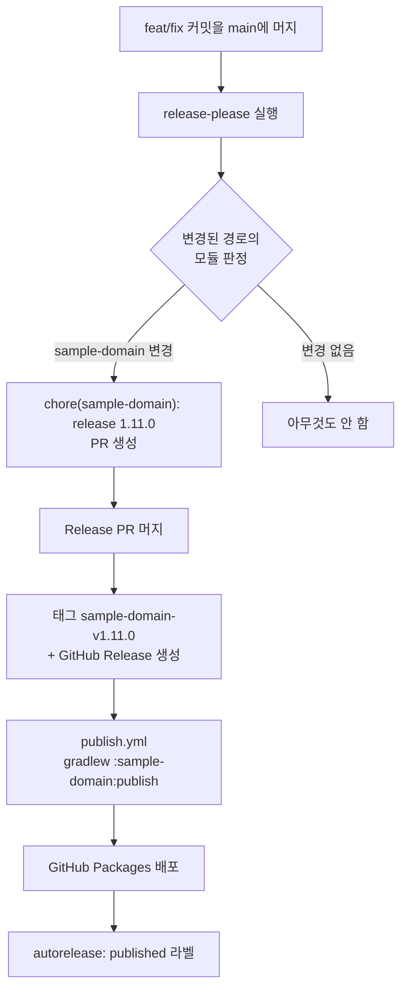

# sample-packages

Gradle 멀티모듈 Java 라이브러리. **release-please**로 모듈별 독립 버전을 관리하고 **GitHub Packages**에 배포합니다.

| 모듈 | 좌표 | 현재 버전 | 태그 형식 |
| --- | --- | --- | --- |
| `sample-domain` | `com.sample:sample-domain` | 1.10.0 | `sample-domain-v1.10.0` |
| `sample-support` | `com.sample:sample-support` | 0.0.0 | `sample-support-v0.0.0` |

모듈은 서로 독립적으로 버전이 올라갑니다. `sample-domain`에만 변경이 있으면 `sample-support`는 그대로 유지됩니다.

---

## 목차

1. [릴리스 흐름](#1-릴리스-흐름)
2. [커밋 규칙](#2-커밋-규칙)
3. [버전 범프 규칙](#3-버전-범프-규칙)
4. [커밋·PR로 버전 제어하기](#4-커밋pr로-버전-제어하기)
5. [현재 설정 해설](#5-현재-설정-해설)
6. [설정 레퍼런스](#6-설정-레퍼런스)
7. [라벨](#7-라벨)
8. [워크플로우](#8-워크플로우)
9. [권한과 리포 설정](#9-권한과-리포-설정)
10. [새 모듈 추가하기](#10-새-모듈-추가하기)
11. [트러블슈팅](#11-트러블슈팅)

---

## 1. 릴리스 흐름



핵심은 **2단계 머지**입니다.

1. 개발자가 `feat:` 커밋을 main에 머지 → release-please가 **Release PR**을 만듭니다 (아직 릴리스 아님)
2. 사람이 Release PR을 검토하고 머지 → 그때 태그·Release·배포가 일어납니다

Release PR에는 버전 파일(`<module>/gradle.properties`)과 `<module>/CHANGELOG.md` 변경이 담겨 있어, 머지 전에 어떤 버전이 나갈지 확인할 수 있습니다.

### 모듈 판정 기준

release-please는 **커밋이 건드린 파일 경로**로 어느 모듈의 변경인지 판단합니다.

- `sample-domain/**` 를 수정한 커밋 → `sample-domain` 릴리스 후보
- 루트나 `.github/**` 만 수정한 커밋 → 어느 모듈에도 속하지 않음 → 릴리스 없음

한 커밋이 두 모듈을 동시에 건드리면 두 모듈 모두 릴리스 후보가 됩니다. 모듈별로 커밋을 나누는 편이 깔끔합니다.

---

## 2. 커밋 규칙

[Conventional Commits](https://www.conventionalcommits.org/) 형식을 **반드시** 따라야 합니다.

```
<type>[optional scope][!]: <description>

[optional body]

[optional footer]
```

예시:

```
feat: [CL1-0001] sample-domain 인사말 기능 추가
fix(parser): 인코딩 오류 수정
feat!: API 시그니처 변경
```

### 타입별 동작

| 타입 | changelog 표시 | 버전 범프 |
| --- | --- | --- |
| `feat` | Features | **minor** |
| `fix` | Bug Fixes | patch |
| `refactor` | Code Refactoring | patch |
| 그 외 (`chore`, `docs`, `test`, `perf`, `ci`, `build`, `style`, `revert` …) | 표시 안 됨 | **릴리스 자체가 생기지 않음** |

> **주의** — `changelog-sections`에 등록되지 않은 타입은 changelog가 비게 되고, release-please는 changelog가 비면 릴리스를 건너뜁니다. 즉 `changelog-sections`는 표시 설정이자 **릴리스 트리거 설정**입니다.
>
> `perf`나 `revert`처럼 사용자 영향이 있는 타입을 릴리스에 포함시키려면 `release-please-config.json`의 `changelog-sections`에 추가해야 합니다. 추가하면 patch 범프로 동작합니다.

### 형식을 벗어난 커밋은 조용히 버려집니다

`[CL1-0000] 수정` 이나 `수정함` 처럼 `type:` 접두사가 없는 메시지는 파서가 예외를 던지고, 해당 커밋은 **경고 없이 무시**됩니다 (`logger.debug`로만 기록). 릴리스에 영원히 반영되지 않으므로 주의하세요.

티켓 번호는 타입 뒤 설명부에 넣으면 됩니다 — `feat: [CL1-0001] ...` 는 정상입니다.

### 커스텀 타입

타입에는 화이트리스트가 없습니다. `hotfix:`, `security:` 같은 커스텀 타입도 형식만 맞으면 파싱됩니다. 다만:

- `changelog-sections`에 등록해야 릴리스가 생깁니다
- 등록하면 **patch**로만 올라갑니다 (minor/major 지정 불가)

### squash 머지 주의

이 리포는 squash 머지를 사용합니다. squash 시 커밋 메시지는 **PR 제목**이 되므로, PR 제목이 conventional 형식이어야 합니다. 아니면 [BEGIN_COMMIT_OVERRIDE](#begin_commit_override)를 사용하세요.

---

## 3. 버전 범프 규칙

### 우선순위

위에서부터 먼저 평가되며, 하나가 걸리면 아래는 무시됩니다.

| 순위 | 레버 | 위치 |
| --- | --- | --- |
| 1 | `release-as` 설정 | 설정 파일 |
| 2 | `Release-As:` 커밋 푸터 | 커밋 메시지 |
| 3 | `versioning` 전략 | 설정 파일 |
| 4 | breaking / feat 판정 | 커밋 타입 |

`versioning`으로 범프 폭을 고정해두더라도 `Release-As:` 푸터는 그대로 동작합니다.

### 기본 전략(`default`)의 판정 로직

```
Release-As: 푸터가 있으면        → 해당 버전으로 고정
breaking change가 하나라도 있으면 → major   (0.x + bump-minor-pre-major 면 minor)
feat 이 하나라도 있으면           → minor   (0.x + bump-patch-for-minor-pre-major 면 patch)
그 외                            → patch
```

마지막 줄이 **fallback**입니다. `changelog-sections` 관문을 통과한 커밋은 무엇이든 최소 patch를 올립니다.

### 0.x 구간 옵션

`sample-support`처럼 버전이 `0.x`인 모듈에만 적용됩니다. 1.0.0 이상에서는 아무 효과가 없습니다.

| 옵션 | 효과 |
| --- | --- |
| `bump-minor-pre-major` | 0.x에서 breaking change를 major 대신 **minor**로 |
| `bump-patch-for-minor-pre-major` | 0.x에서 `feat`을 minor 대신 **patch**로 |

`sample-support`(0.0.0) 기준 비교:

| 커밋 | 기본값 | `bump-minor-pre-major` | 둘 다 켬 |
| --- | --- | --- | --- |
| breaking | **1.0.0** | 0.1.0 | 0.1.0 |
| `feat` | 0.1.0 | 0.1.0 | **0.0.1** |
| `fix` | 0.0.1 | 0.0.1 | 0.0.1 |

> 기본값에서는 breaking change 하나로 `0.0.0 → 1.0.0` 으로 튑니다. 0.x를 유지하려면 `bump-minor-pre-major`를 켜세요.

### `versioning` 전략 목록

| 값 | 동작 |
| --- | --- |
| `default` *(기본)* | 위 판정 로직 |
| `always-bump-patch` | 커밋 타입과 무관하게 항상 patch |
| `always-bump-minor` | 항상 minor |
| `always-bump-major` | 항상 major |
| `service-pack` | `1.2.3-sp.1` 형태로 4번째 자리 증가 (유지보수 브랜치용) |
| `prerelease` | `prerelease-type`과 함께 alpha/beta/rc |

### 설정할 수 없는 것

**"커밋 타입 → 범프 폭" 매핑은 설정으로 변경할 수 없습니다.** `feat`이 minor인 것은 release-please 소스에 하드코딩되어 있고, `changelog-sections` 항목에도 범프 관련 필드가 없습니다 (`type`, `section`, `hidden` 뿐).

타입별 세밀한 제어가 필요하면 `Release-As:` 푸터로 커밋마다 지정하는 것이 유일한 방법입니다.

---

## 4. 커밋·PR로 버전 제어하기

### `Release-As:` — 버전 강제 지정

가장 우선순위가 높습니다.

```
fix: 사소한 수정

Release-As: 2.0.0
```

`fix`임에도 다음 릴리스가 2.0.0이 됩니다.

### breaking change — major 올리기

두 가지 방법 모두 동작합니다.

```
feat!: 인증 방식 전면 교체
```

```
feat: 인증 방식 전면 교체

BREAKING CHANGE: authenticate() 시그니처가 변경되었습니다.
```

### `BEGIN_COMMIT_OVERRIDE`

**PR 본문**에 아래 블록을 넣으면 release-please가 커밋 메시지 대신 그 내용을 읽습니다.

```
BEGIN_COMMIT_OVERRIDE
feat: 인사말 기능 추가
fix: 인코딩 오류 수정
END_COMMIT_OVERRIDE
```

두 가지 상황에 유용합니다.

- squash 머지 제목이 conventional 형식이 아닐 때 구제
- 커밋 하나에서 changelog 항목을 여러 개 만들기

### `autorelease: snooze` 라벨

Release PR에 이 라벨을 붙이면 release-please가 해당 PR을 갱신하지 않고 보류합니다. 설정 없이 바로 사용할 수 있습니다.

---

## 5. 현재 설정 해설

`release-please-config.json`:

```json
{
  "release-type": "java",
  "include-component-in-tag": true,
  "separate-pull-requests": true,
  "bootstrap-sha": "25305c804d7974f0f7d81989f94a1a09716b2883",
  "pull-request-title-pattern": "chore(${component}): release ${version}",
  "component-no-space": true,
  "changelog-sections": [
    { "type": "feat",     "section": "Features" },
    { "type": "fix",      "section": "Bug Fixes" },
    { "type": "refactor", "section": "Code Refactoring" }
  ],
  "packages": {
    "sample-domain": {
      "component": "sample-domain",
      "skip-snapshot": true,
      "extra-files": ["gradle.properties"]
    },
    "sample-support": { ... }
  }
}
```

| 항목 | 의미 |
| --- | --- |
| `release-type: java` | Java 전략. SNAPSHOT 개념을 이해하는 전략입니다 |
| `include-component-in-tag: true` | 태그에 모듈명 포함 → `sample-domain-v1.10.0` |
| `separate-pull-requests: true` | 모듈마다 별도 Release PR |
| `component-no-space: true` | `${component}` 앞에 공백을 자동으로 붙이는 기본 동작을 끕니다. 끄지 않으면 제목이 `chore( sample-domain)`처럼 나옵니다 |
| `bootstrap-sha` | 릴리스 이력이 없는 모듈이 이 커밋 이후만 스캔하도록 제한. 없으면 첫 릴리스 changelog에 전체 히스토리가 딸려옵니다 |
| `component` | 태그·PR 제목에 쓰이는 모듈 식별자 |
| `skip-snapshot` | SNAPSHOT 승격 PR을 만들지 않음 |
| `extra-files` | 버전을 갱신할 파일. 패키지 경로 기준 상대 경로입니다 |

`.release-please-manifest.json`은 **마지막으로 릴리스된 버전**을 기록합니다. 직접 수정하지 마세요 — release-please가 관리합니다.

```json
{
  "sample-domain": "1.10.0",
  "sample-support": "0.0.0"
}
```

### 버전 파일

각 모듈의 `gradle.properties`에 마커로 감싼 버전이 있습니다. release-please가 이 사이의 값을 갱신합니다.

```properties
# x-release-please-start-version
version=1.10.0
# x-release-please-end
```

`skip-snapshot`을 켰기 때문에 체크인된 버전은 항상 "마지막 릴리스 버전"과 같습니다. `-SNAPSHOT` 접미사는 사용하지 않습니다.

---

## 6. 설정 레퍼런스

### 패키지 레벨 옵션

루트에 쓰면 전체 기본값, `packages.<path>` 안에 쓰면 해당 모듈에만 적용됩니다. **패키지 설정이 루트를 덮어씁니다.**

| 옵션 | 타입 | 설명 |
| --- | --- | --- |
| `release-type` | string | 사용할 릴리스 전략 |
| `versioning` | string | 버전 전략. 기본 `default` |
| `component` | string | 태그·PR 제목에 쓰는 모듈 식별자 |
| `bump-minor-pre-major` | boolean | 0.x에서 breaking을 minor로 |
| `bump-patch-for-minor-pre-major` | boolean | 0.x에서 feat을 patch로 |
| `release-as` | string | *(DEPRECATED)* 다음 버전 고정 |
| `prerelease` | boolean | GitHub Release를 프리릴리스로 |
| `prerelease-type` | string | prerelease 전략의 접미사 (alpha/beta/rc) |
| `initial-version` | string | 첫 릴리스 버전 지정 |
| `draft` | boolean | GitHub Release를 draft로 |
| `draft-pull-request` | boolean | Release PR을 draft로 |
| `force-tag-creation` | boolean | draft여도 태그를 즉시 생성 |
| `changelog-sections` | array | changelog 섹션 + **릴리스 트리거 타입** |
| `changelog-path` | string | changelog 파일 경로. 기본 `CHANGELOG.md` |
| `changelog-type` | string | `default` 또는 `github` |
| `changelog-host` | string | GitHub Enterprise용 링크 호스트 |
| `skip-changelog` | boolean | changelog 생성 생략 |
| `skip-github-release` | boolean | GitHub Release 생성 생략 |
| `skip-snapshot` | boolean | SNAPSHOT PR 생략 (java 전략) |
| `snapshot-label` | string | SNAPSHOT PR에 붙일 라벨 |
| `extra-files` | array | 버전을 갱신할 추가 파일 |
| `version-file` | string | ruby·simple 전략용 버전 파일 |
| `exclude-paths` | array | 파싱에서 제외할 경로 |
| `include-component-in-tag` | boolean | 태그에 모듈명 포함. 기본 `true` |
| `include-v-in-tag` | boolean | 태그에 `v` 포함. 기본 `true` |
| `include-v-in-release-name` | boolean | Release 이름에 `v` 포함. 기본 `true` |
| `tag-separator` | string | 모듈명과 버전 사이 구분자 |
| `component-no-space` | boolean | `${component}` 앞 공백 자동 삽입 비활성화 |
| `pull-request-title-pattern` | string | Release PR 제목 패턴 |
| `pull-request-header` | string | Release PR 본문 머리말 |
| `pull-request-footer` | string | Release PR 본문 꼬리말 |
| `separate-pull-requests` | boolean | 모듈별 PR 분리. 기본 `false` |
| `always-update` | boolean | 변경이 없어도 PR 갱신. 기본 `false` |
| `extra-label` | string | 새 PR에 추가할 라벨 (쉼표 구분) |
| `date-format` | string | generic 전략의 날짜 형식 (strftime) |

> `component`는 스키마에 선언돼 있지 않지만 release-please가 실제로 읽는 옵션입니다. 스키마 검증기에서 경고가 나지 않는 이유는 해당 객체에 `additionalProperties` 제약이 없기 때문입니다.

### 루트 전용 옵션

`packages` 안에 넣으면 **조용히 무시됩니다.**

| 옵션 | 타입 | 설명 |
| --- | --- | --- |
| `bootstrap-sha` | string | 릴리스 이력이 없을 때 스캔 시작 지점 |
| `last-release-sha` | string | 모든 릴리스에서 스캔 시작 지점 |
| `plugins` | array | 적용할 플러그인 |
| `label` | string | Release PR 식별 라벨. 기본 `autorelease: pending` |
| `release-label` | string | 릴리스 완료 PR 라벨. 기본 `autorelease: tagged` |
| `group-pull-request-title-pattern` | string | PR을 묶을 때의 제목 패턴 |
| `signoff` | string | 커밋에 넣을 Signed-off-by |
| `sequential-calls` | boolean | PR·Release를 순차 생성 (rate limit 회피) |
| `commit-search-depth` | number | 커밋 히스토리 탐색 깊이 |
| `release-search-depth` | number | 기존 릴리스 탐색 깊이 |
| `commit-batch-size` | number | API 호출당 커밋 수. 기본 10 |
| `always-link-local` | boolean | `node-workspace` 플러그인용 |

### `extra-files` 형식

**마커 방식** — 파일에 주석 마커를 넣고 경로만 지정합니다. 형식 무관.

```json
"extra-files": ["gradle.properties"]
```

```properties
# x-release-please-start-version
version=1.9.0
# x-release-please-end
```

`# x-release-please-version` 한 줄 형태도 지원합니다.

**경로 지정 방식** — 구조화된 파일의 특정 위치를 jsonpath로 갱신합니다.

```json
"extra-files": [
  { "type": "json", "path": "package.json", "jsonpath": "$.version" },
  { "type": "yaml", "path": "chart.yaml",   "jsonpath": "$.appVersion", "glob": true }
]
```

스키마상 `type`은 `json` · `yaml` · `toml`입니다. 내부 구현에는 `xml` · `pom` 업데이터도 존재합니다.

### 플러그인 (`plugins`)

| 플러그인 | 용도 |
| --- | --- |
| `linked-versions` | 여러 모듈의 버전을 하나로 묶어 함께 올림 (독립 버전 관리의 반대) |
| `node-workspace` | npm workspace 내부 의존성 버전 연동 |
| `cargo-workspace` | Cargo workspace 연동 |
| `maven-workspace` | Maven 멀티모듈 의존성 연동 |
| `sentence-case` | changelog 항목 첫 글자 대문자화 |
| `group-priority` | 여러 릴리스가 겹칠 때 우선순위 지정 |

이 리포는 플러그인을 사용하지 않습니다. Gradle 모듈 간 의존이 생기고 버전을 함께 올리고 싶다면 `linked-versions`를 검토하세요.

### `release-type` 목록

현재 `java`를 사용합니다. 전체 목록:

```
dotnet-yoshi, go, go-yoshi, go-librarian, java, maven, java-yoshi,
java-yoshi-mono-repo, java-backport, java-bom, java-lts, krm-blueprint,
node, node-librarian, expo, ocaml, php, php-yoshi, php-librarian,
python, python-librarian, r, ruby, ruby-yoshi, ruby-librarian, rust,
salesforce, sfdx, simple, terraform-module, helm, elixir, dart, bazel
```

`java`는 범용 Java 전략입니다. `maven`은 `pom.xml`을 직접 파싱하므로 Gradle 프로젝트에는 맞지 않습니다.

### `changelog-type`

| 값 | 동작 |
| --- | --- |
| `default` *(기본)* | conventional commits 기반으로 직접 생성 |
| `github` | GitHub의 자동 릴리스 노트 생성 API 사용 |

---

## 7. 라벨

| 라벨 | 붙이는 주체 | 의미 |
| --- | --- | --- |
| `autorelease: pending` | release-please | Release PR 생성됨, 아직 릴리스 전 |
| `autorelease: tagged` | release-please | 태그·Release 생성 완료 |
| `autorelease: snapshot` | release-please | SNAPSHOT PR *(현재 미사용)* |
| `autorelease: snooze` | **사람이 수동으로** | 해당 PR 갱신 보류 |
| `autorelease: published` | `release-please.yml`의 `label-published` job | 아티팩트 배포 완료 |

`autorelease: published`는 release-please의 기능이 아닙니다. 이 리포가 자체 워크플로우로 배포하기 때문에 배포 완료 표시를 직접 붙입니다. release-please는 이 라벨을 읽지 않으므로 순수하게 사람이 보는 용도입니다.

---

## 8. 워크플로우

### `.github/workflows/release-please.yml`

main 푸시마다 실행됩니다.

| Job | 역할 |
| --- | --- |
| `release-please` | Release PR 생성/갱신, 태그·Release 생성. 릴리스된 모듈을 `publish_matrix`로 출력 |
| `publish` | 매트릭스로 모듈별 `publish.yml` 호출 (병렬, `fail-fast: false`) |
| `label-published` | 머지된 Release PR에 `autorelease: published` 라벨 부착 |

`publish_matrix`는 release-please 출력에서 `*--tag_name` 항목을 추출해 만듭니다.

```json
[{"module":"sample-domain","tag":"sample-domain-v1.11.0"}]
```

릴리스가 없으면 `[]`가 되고 이후 job은 모두 skip됩니다.

### `.github/workflows/publish.yml`

`module`과 `tag`를 받아 해당 태그를 checkout하고 그 모듈만 배포합니다.

```bash
./gradlew :${module}:publish
```

수동 실행도 가능합니다 — Actions 탭에서 `module`(예: `sample-domain`)과 `tag`(예: `sample-domain-v1.10.0`)를 입력하세요.

### 필요한 권한

`GITHUB_TOKEN`만 사용하며, job별 최소 권한을 명시합니다. 자세한 내용은 [9. 권한과 리포 설정](#9-권한과-리포-설정)을 참고하세요.

---

## 9. 권한과 리포 설정

이 리포는 **`GITHUB_TOKEN`만 사용합니다.** 별도 PAT나 GitHub App 토큰을 등록할 필요가 없습니다.

### Job별 부여 권한

워크플로우 상단 블록과 job별 블록으로 최소 권한만 부여합니다. 실제 실행에서 부여된 값입니다.

| Job | Contents | PullRequests | Issues | Packages |
| --- | --- | --- | --- | --- |
| `release-please` | write | write | write | — |
| `publish` | read | — | — | write |
| `label-published` | — | write | write | — |

`Metadata: read`는 모든 job에 자동으로 부여됩니다.

### 각 권한이 필요한 이유

| 권한 | 사용처 |
| --- | --- |
| `contents: write` | 태그·GitHub Release 생성, Release PR 브랜치 푸시 |
| `pull-requests: write` | Release PR 생성·갱신, `gh pr edit --add-label` |
| `issues: write` | 라벨 생성·관리 |
| `contents: read` | 릴리스 태그 checkout |
| `packages: write` | GitHub Packages 업로드 |

> **라벨은 issues API 리소스입니다.** PR에 붙이는 라벨이라도 `issues: write`가 필요합니다. `pull-requests: write`만 주면 라벨 단계에서 `Resource not accessible by integration`이 발생합니다.

### `permissions` 블록의 동작

**블록을 선언하면 명시하지 않은 스코프는 전부 `none`이 됩니다.** 워크플로우 상단에 `contents: write`가 있어도, job이 자체 블록을 가지면 상단 값을 물려받지 않습니다.

`label-published`가 `contents` 권한 없이 동작하는 것이 그 예입니다 — checkout을 하지 않으므로 문제없습니다.

### 재사용 워크플로우(`publish.yml`)의 권한

호출하는 쪽이 선언한 `permissions`가 상한이 됩니다.

```yaml
publish:
  uses: ./.github/workflows/publish.yml
  permissions:
    contents: read
    packages: write
  secrets: inherit
```

`GITHUB_TOKEN` 자체는 `secrets: inherit` 없이도 재사용 워크플로우에 전달됩니다. `secrets: inherit`은 그 외 시크릿까지 함께 넘기기 위한 설정입니다.

### Gradle 배포 인증

`publish.yml`이 `GITHUB_TOKEN`을 그대로 Gradle에 넘깁니다.

```yaml
env:
  GPR_USER: x-access-token
  GPR_TOKEN: ${{ secrets.GITHUB_TOKEN }}
```

사용자명은 `x-access-token` 고정입니다. `build-logic/src/main/kotlin/sample.publish-conventions.gradle.kts`가 이 두 환경변수를 읽습니다 (Gradle 속성 `gpr.user` / `gpr.token`이 있으면 그쪽이 우선).

### 리포 설정

`Settings → Actions → General → Workflow permissions`:

| 설정 | 필요 여부 |
| --- | --- |
| **Allow GitHub Actions to create and approve pull requests** | **필수.** 꺼져 있으면 release-please가 Release PR을 만들지 못합니다 |
| Read and write permissions / Read repository contents | **무관.** 모든 job이 `permissions`를 명시하므로 기본값의 영향을 받지 않습니다 |

`permissions` 블록은 기본값이 읽기 전용이어도 write로 올려 받을 수 있습니다. 그 설정은 **블록이 없을 때의 기본값**만 정합니다.

### 제약 — GITHUB_TOKEN 이벤트는 워크플로우를 트리거하지 않습니다

`GITHUB_TOKEN`으로 만든 태그·Release는 **다른 워크플로우를 실행시키지 않습니다.** 무한 루프를 막기 위한 GitHub 정책입니다.

그래서 이 리포는 배포를 `on: push: tags` 같은 별도 트리거로 분리하지 않고, `release-please.yml` 안에서 `uses:`로 `publish.yml`을 직접 호출합니다. 같은 실행 안에서 이어지므로 트리거 제약을 받지 않습니다.

### PAT가 필요해지는 경우

현재 구조에서는 불필요하지만, 아래 상황에서는 `GITHUB_TOKEN`으로 부족합니다.

- 태그·Release 이벤트로 **다른 워크플로우를 트리거**하고 싶을 때
- **다른 리포지토리**에 릴리스하거나 배포할 때
- **브랜치 보호 규칙을 우회**해야 할 때 (`GITHUB_TOKEN`은 우회 불가)

---

## 10. 새 모듈 추가하기

`sample-support` 추가 시 수행한 절차입니다.

**1. 모듈 디렉터리 생성**

```
sample-newmodule/
├── build.gradle.kts
├── gradle.properties
└── src/main/java/...
```

`build.gradle.kts`:

```kotlin
plugins {
    id("sample.java-conventions")
    id("sample.publish-conventions")
}

dependencies {
}
```

`gradle.properties`:

```properties
# x-release-please-start-version
version=0.0.0
# x-release-please-end
```

**2. `settings.gradle.kts`에 등록**

```kotlin
include(
    "sample-domain",
    "sample-support",
    "sample-newmodule"
)
```

**3. `release-please-config.json`의 `packages`에 추가**

```json
"sample-newmodule": {
  "component": "sample-newmodule",
  "skip-snapshot": true,
  "bump-minor-pre-major": true,
  "extra-files": ["gradle.properties"]
}
```

**4. `.release-please-manifest.json`에 추가**

```json
"sample-newmodule": "0.0.0"
```

`0.0.0`으로 시작하면 첫 `feat` 커밋에서 `0.1.0`이 됩니다.

**5. 확인**

```bash
./gradlew :sample-newmodule:build
./gradlew -q :sample-newmodule:properties | grep '^version:'
```

> 서브프로젝트의 `gradle.properties`는 Gradle이 해당 프로젝트의 속성으로 읽어들입니다. 루트 `gradle.properties`에는 `group`과 데몬 설정만 두고 버전은 모듈별로 관리합니다.

---

## 11. 트러블슈팅

### Release PR이 안 생깁니다

워크플로우 로그에서 `No user facing commits found ... - skipping`을 확인하세요. 원인은 대부분 셋 중 하나입니다.

1. **커밋 타입이 `changelog-sections`에 없음** — `chore`, `docs`, `perf` 등은 릴리스를 만들지 않습니다
2. **커밋 메시지가 conventional 형식이 아님** — 파싱 실패 시 조용히 무시됩니다
3. **커밋이 모듈 경로를 건드리지 않음** — 루트나 `.github/` 만 바뀌면 어느 모듈에도 속하지 않습니다

`Allow GitHub Actions to create and approve pull requests` 설정도 확인하세요.

### 배포가 실패했습니다

`publish` job은 `fail-fast: false`이므로 다른 모듈은 계속 진행됩니다. 실패한 모듈만 `publish.yml`을 수동 실행해 재배포할 수 있습니다 (`module` + `tag` 입력).

단, 하나라도 실패하면 `publish` job 전체가 실패로 집계되어 `label-published`는 skip됩니다. 라벨은 필요하면 수동으로 붙이세요.

### 버전이 예상과 다릅니다

우선순위를 확인하세요. `Release-As:` 푸터가 있으면 다른 모든 판정을 무시합니다. 0.x 모듈이라면 `bump-minor-pre-major` 설정 여부에 따라 breaking change의 결과가 달라집니다.

### 첫 릴리스 changelog에 과거 커밋이 전부 들어옵니다

해당 모듈의 태그를 release-please가 찾지 못해 히스토리 전체를 스캔한 경우입니다. 루트에 `bootstrap-sha`를 지정하세요.

### 로컬 빌드 산출물과 배포본의 버전이 같습니다

`skip-snapshot`을 사용하므로 릴리스 사이에는 체크인된 버전이 마지막 릴리스 버전과 동일합니다. `publishToMavenLocal`을 사용하고 소비 측에 `mavenLocal()`이 있으면 배포본 대신 로컬 빌드가 잡힐 수 있으니 주의하세요.

---

## 로컬 개발

```bash
./gradlew build                    # 전체 빌드
./gradlew :sample-domain:build     # 특정 모듈만
./gradlew :sample-domain:javadoc   # javadoc 생성
```

Java 8 toolchain, JUnit 5 + AssertJ, 소스·javadoc jar 자동 생성 (`build-logic/src/main/kotlin/sample.java-conventions.gradle.kts`).
